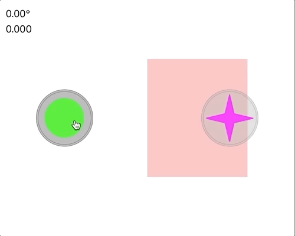

# Joystick

A custom UIView in Swift that presents a simple joystick interface. The custom view consists of two UIImageView
instances, one for the base and one for the handle. Moving the handle generates two values

* angle — the direction the handle is point, given in degrees, where north/up is 0° and east/right is 90°
* displacement — the distance from the center the handle moved, from 0.0 to 1.0 with 1.0.

The view supports an option (`movable`) where the view will move when the user moves the handle to a
displacement beyond 1.0. This can be useful when the initial position of the joystick in an app is not ideal for
the user's thumb. Double-tapping on the joystick moves it back to its original position.

In the animation above, there are two joysticks, one green and one red. The green is *fixed* and does not move
even when the touch motion would cause a displacement larger than 1.0. The yello joystick however is *movable*,
with the base following the touch motion. Base motion is optionally restricted to a `CGRect`, as is the case in
the demonstration animation above where the yellow joystick cannot move into the red band.

# Code

The Xcode workspace contains three components: 

- a framework called [JoyStickView](./JoyStickView)
- a simple iOS application called [JoyStickViewApp](./JoyStickViewApp)
- a playground called [JoyStickView Playground](./JoyStickView%20Playground.playground/Contents.swift)

Both the playground and the app rely on the framework for the JoyStickView UIView.

The Xcode playground code sets up the display environemnt and installs two joysticks, one that is fixed (green)
and the other that is movable (red). Both joysticks report out their positions in two labels, one for angles and
the other for displacement.

The [JoyStickView.swift](./JoyStickView/Src/JoyStickView.swift) file defines the joystick view
and behavior. It resides inside JoyStickView framework (./JoyStickView/Src). There you will also find a file 
called [CoreGraphics+Additions.swift](./JoyStickView/Src/CoreGraphics+Additions.swift) that contains
various extensions to some CoreGraphics structs that allow for some simplified mathematical expressions in the
JoyStickView code.

The `JoyStickView.swift` depends on two image assets found in the [Images](./JoyStickView/Src/Images)
folder:

* JoyStickBase\*.png — the image to use for the base of the joystick
* JoyStickHandle\*.png — the image to use for the handle of the joystick. **Note**: this will be tinted with
  the `handleTintColor` setting (defaults to the view's `tintColor` parameter)

Both exist in three resolutions for the various iOS devices out today. They were generated using the great
[Opacity](http://likethought.com/opacity/) app. The Opacity documents are included in this repository in the [Resources](./JoyStickView/Resources) directory.
